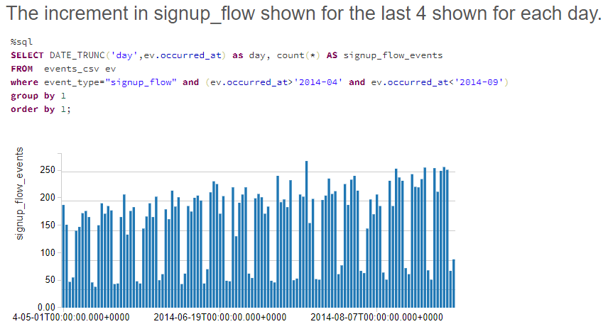
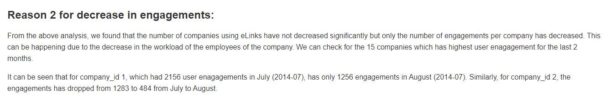

# User-Engagement-Analysis
## Summary:
This project is aimed to determine the user engagement for an enterprise networking company’s software known as eLinks and the reasons behind the decrement using SQL queries using Databricks. This repository includes all the files that are used in this project to determine the reasons behind the reduction in the user engagement. The project determines the following information from the given data:
(1) Has actually user activity or engagement dropped recently and if so, how serious or significant is it?
(2) The possible reasons for the drop in activity, and investigation for each of these potential reasons by conducting time-series analysis using the relevant data, writing SQL queries, and generating related visualizations.

## Analysis:
The Jupyter Notebook uploaded in this repository includes all the queries. However, to look at the trend using graphs, it is best recommended to check the link mentioned below where the analysis has been performed. 

The link for the analysis is: https://databricks-prod-cloudfront.cloud.databricks.com/public/4027ec902e239c93eaaa8714f173bcfc/3007571033566758/3282462353226895/1538677595945462/latest.html
A databricks account is not required to open this link and review the analysis. 

Some glimpse of the analysis:

